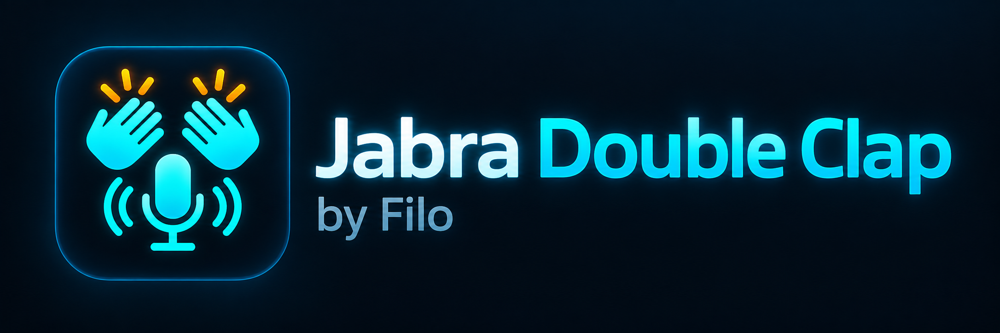

# Jabra Double Clap for Home Assistant



Eine experimentelle Home-Assistant-App zur Erkennung von Doppelklatschen über ein angeschlossenes Jabra-Audiogerät.

**Entwickelt von Filo**

## Funktionen

- Doppelklatsch-Erkennung über den Jabra Link 390
- Erkennt kurze, scharfe Klatschimpulse statt nur allgemeine Lautstärke
- Auswertung von Peak, RMS, Crest Factor, Sharpness und Impulsdauer
- Einstellbares Zeitfenster zwischen beiden Klatschern
- Lokaler Home-Assistant-Webhook als Trigger
- Einstellbare Empfindlichkeit
- Keine Speicherung von Sprach- oder Audiodaten
- Läuft parallel zu Home Assistant Assist Satellite

## Installation

1. In Home Assistant zu  
   **Einstellungen → Apps → App-Store → Repositories** gehen.

2. Dieses Repository hinzufügen:

   ```text
   https://github.com/shdtfy/jabra-clap-ha
